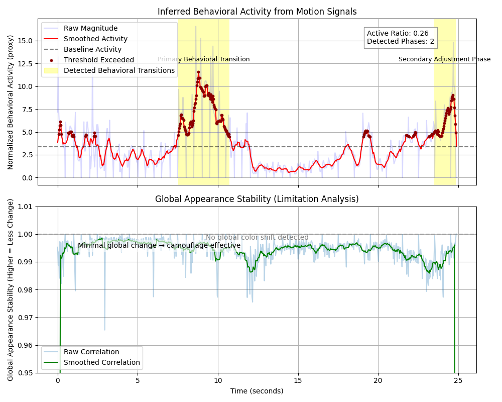

# Sentiment Analysis of Cephalopods
**GSoC 2026 Entry Task — Behavioral Analysis Pipeline**

This repository provides a specialized pipeline for the automated and interpretable analysis of cephalopod behavior from video data. By leveraging computer vision techniques such as optical flow and color-space histogram analysis, the system extracts high-fidelity behavioral signals that serve as proxies for biological states like crypsis, stress, and locomotion.

---

## Table of Contents
1. [System Overview](#system-overview)
2. [Architecture & Methodology](#architecture--methodology)
   - [Motion Magnitude (Optical Flow)](#motion-magnitude-optical-flow)
   - [Global Appearance Stability (HSV)](#global-appearance-stability-hsv)
3. [Project Structure](#project-structure)
4. [Installation & Usage](#installation--usage)
5. [Behavioral Analysis Results](#behavioral-analysis-results)
6. [Research Reasoning](#research-reasoning)
7. [Future Roadmap](#future-roadmap)

---

## 1. System Overview

The pipeline transforms raw underwater video sequences into structured behavioral insights:
- **Temporal Segmentation**: Automated detection of behavioral phases.
- **Multi-Modal Feature Extraction**: Synchronization of motion and color stability signals.
- **Visual Validation**: Generation of motion heatmaps for spatial localization.
- **Rule-Based Mapping**: Categorization of extracted signals into interpretable behavioral states.

---

## 2. Architecture & Methodology

The system is designed for modularity and scientific interpretability.

### 2.1 Motion Magnitude (Optical Flow)
Using the **Farneback Dense Optical Flow** algorithm, we calculate the displacement of pixels between consecutive frames. The mean magnitude across the frame provides a robust metric for physical activity, identifying bursts of movement or subtle adjustments.

### 2.2 Global Appearance Stability (HSV Histograms)
Cephalopods often change color locally without altering their global appearance significantly during camouflage. We compute 2D Hue/Saturation histograms to monitor the consistency of the animal's visual profile over time.

| Feature Layer | Method | Targeted Behavior |
| --- | --- | --- |
| **Motion Magnitude** | Farneback Optical Flow | Locomotion, Repositioning, Startle |
| **Color Stability** | HSV Histogram Correlation | Camouflage Persistence, Skin Texture |
| **Phasal Analysis** | Smoothing & Thresholding | Activity Duration, Behavioral Shifts |

---

## 3. Project Structure

| File / Directory | Description |
| --- | --- |
| `analyze_behavior.ipynb` | Core analysis notebook with feature extraction and visualization. |
| `src/` | Modular Python scripts for data loading and preprocessing. |
| `data/` | Directory for input video files. |
| `results/` | Generated plots, heatmaps, and analysis videos. |
| `requirements.txt` | Project dependencies. |

---

## 4. Installation & Usage

### Prerequisites
- Python 3.9+
- Conda or virtualenv (recommended)

### Setup
1. **Clone the repository:**
   ```bash
   git clone https://github.com/your-username/Sentiment-Analysis-of-Cephalopods.git
   cd Sentiment-Analysis-of-Cephalopods
   ```

2. **Install dependencies:**
   ```bash
   pip install -r requirements.txt
   ```

### Execution
1. **Prepare Data**: Place your input video in the `data/` folder (default: `data/video_fixed.mp4`).
2. **Run Analysis**: Open and run all cells in `analyze_behavior.ipynb`.
3. **Review Results**: Outputs are saved in the `results/` folder, including:
   - `feature_plots.png`: Detailed time-series analysis.
   - `output_heatmap.mp4`: Motion intensity overlay video.

---

## 5. Behavioral Analysis Results

### 5.1 Temporal Feature Mapping

[▶ View Motion Heatmap Video](results/behavioral_analysis.mp4)
The analysis reveals distinct behavioral phases where movement occurs without corresponding global appearance shifts, suggesting localized camouflage or adjustments.

### 5.2 Spatial Localization
The system generates a motion-intensity heatmap to validate the spatial distribution of detected movement, ensuring that the signals correspond accurately to the specimen's activity.

---

## 6. Research Reasoning

This pipeline implements a hypothesis-driven approach:
- **Interpretability**: Prioritizing visual signals that can be verified by biologists.
- **Cross-Feature Decoupling**: Analyzing how motion and color act independently.
- **Failure Analysis**: Identifying specific conditions where global metrics may fail (e.g., perfect crypsis).

---

## 7. Future Roadmap

Future iterations of this system aim to integrate:
- **Pose Estimation**: Tracking individual limb movements.
- **Texture Tracking**: Localized Gabor filter analysis for complex camouflage.
- **Deep Learning integration**: Moving from rule-based to supervised classification using labeled behavioral datasets.
