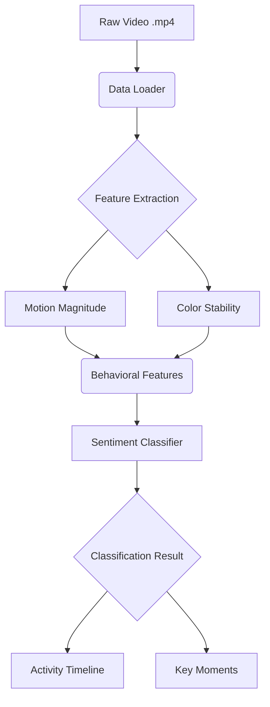
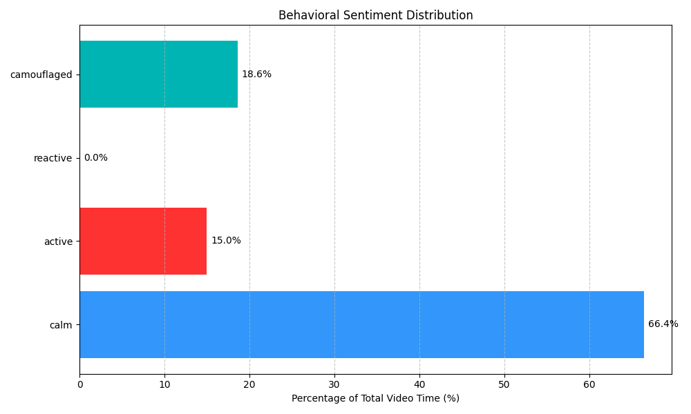
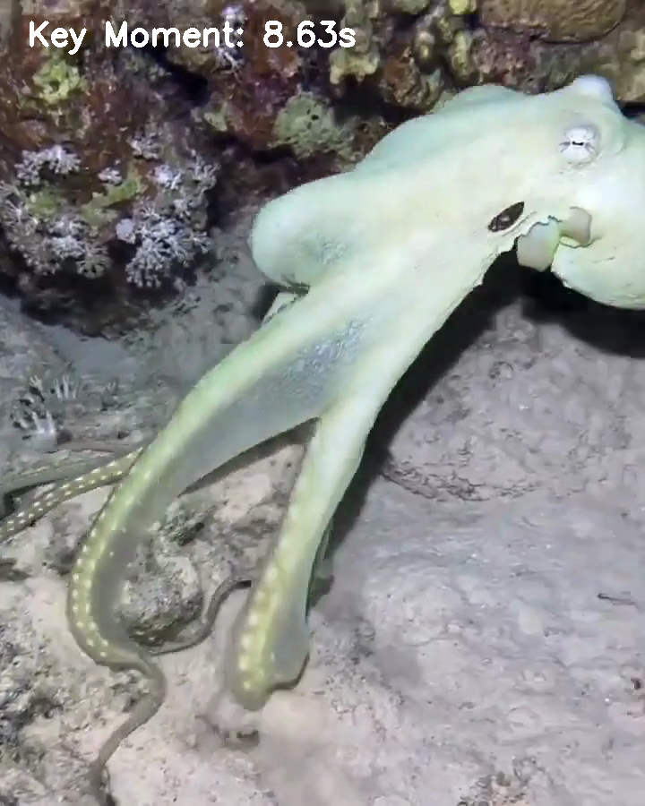
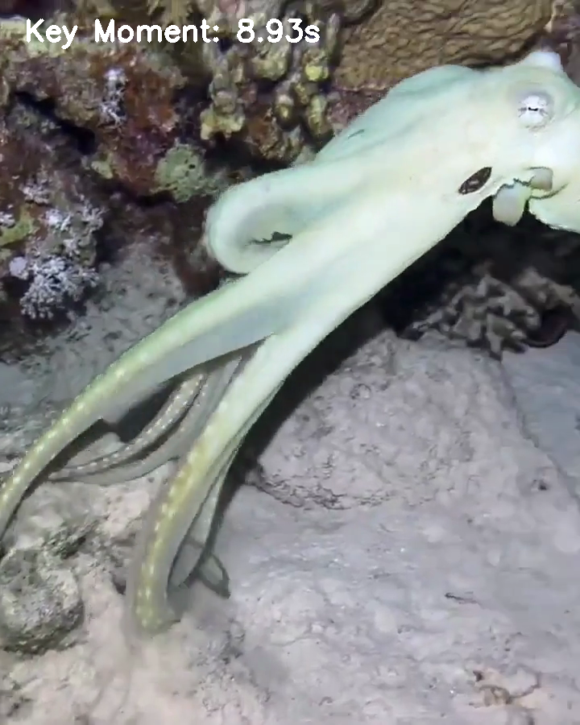
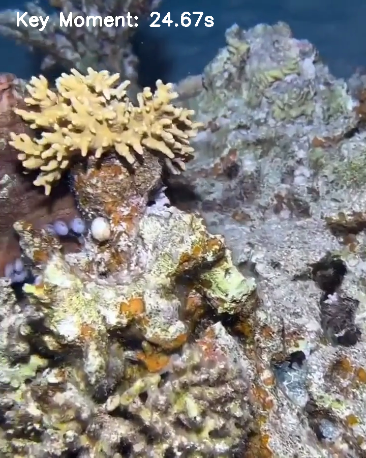

#  Sentiment Analysis of Cephalopods
**GSoC 2026 Entry Task — Behavioral Analysis Pipeline**

This repository provides a specialized pipeline for the automated and interpretable analysis of cephalopod behavior from video data. By leveraging computer vision techniques such as optical flow and color-space histogram analysis, the system extracts high-fidelity behavioral signals that serve as proxies for biological states like crypsis, stress, and locomotion.

---

## Table of Contents
1. [System Overview](#1-system-overview)
2. [Architecture & Methodology](#2-architecture--methodology)
3. [Project Structure](#3-project-structure)
4. [Installation & Usage](#4-installation--usage)
5. [Behavioral Analysis Results](#5-behavioral-analysis-results)
6. [Research Reasoning](#6-research-reasoning)
7. [Future Roadmap](#7-future-roadmap)

---

## 1. System Overview

The pipeline transforms raw underwater video sequences into structured behavioral insights:
- **Temporal Segmentation**: Automated detection of behavioral phases.
- **Multi-Modal Feature Extraction**: Synchronization of motion and color stability signals.
- **Visual Validation**: Generation of motion heatmaps for spatial localization.
- **Rule-Based Mapping**: Categorization of extracted signals into interpretable behavioral states.

### Key Upgrades (v2.0)
- **Side-by-Side Synthesis**: Visual comparison of raw footage vs. motion heatmaps.
- **Activity Timeline Overlay**: Real-time temporal segmentation bar.
- **Key Moment Extraction**: Automatic capture of peak behavioral shifts.

---

## 2. Architecture & Methodology

The system is designed for modularity and scientific interpretability.

### 2.1 Motion Magnitude (Optical Flow)
Using the **Farneback Dense Optical Flow** algorithm, we calculate the displacement of pixels between consecutive frames.

### 2.2 Global Appearance Stability (HSV Histograms)
Cephalopods often change color locally without altering their global appearance significantly during camouflage. We compute 2D Hue/Saturation histograms to monitor consistency.

| Feature Layer | Method | Targeted Behavior |
| --- | --- | --- |
| **Motion Magnitude** | Farneback Optical Flow | Locomotion, Repositioning, Startle |
| **Color Stability** | HSV Histogram Correlation | Camouflage Persistence, Skin Texture |
| **Phasal Analysis** | Smoothing & Thresholding | Activity Duration, Behavioral Shifts |

### 2.3 Pipeline Logic


---

## 3. Project Structure

| File / Directory | Description |
| --- | --- |
| `main.py` | Command-line entry point for full pipeline execution. |
| `analyze_behavior.ipynb` | Analysis notebook with feature extraction. |
| `src/` | Modular Python scripts (Preprocessor, Classifier, Visualizer). |
| `data/` | Directory for input video files. |
| `results/` | Generated plots, heatmaps, and analysis videos. |

---

## 4. Installation & Usage

### Setup
1. **Clone the repository:**
   ```bash
   git clone https://github.com/your-username/Sentiment-Analysis-of-Cephalopods.git
   cd Sentiment-Analysis-of-Cephalopods
   ```
2. **Install dependencies:**
   ```bash
   pip install -r requirements.txt  # Requires OpenCV, NumPy, tqdm, Matplotlib
   ```

### Execution (CLI)
Run the full pipeline with a single command:
```bash
python main.py --video data/video_fixed.mp4
```

---

## 5. Behavioral Analysis Results

### 5.1 Side-by-Side Analysis
The pipeline generates a synchronized visualization showing the original behavior alongside the motion-intensity heatmap and activity timeline.

[▶ View Side-by-Side Analysis Video](results/side_by_side_analysis.mp4)

### 5.2 Analytical Proof (Quantified Behavior)
| Feature Time-Series (Motion vs. Color) | Behavioral State Distribution |
| :---: | :---: |
|  |  |

### 5.3 Key Behavioral Moments
The system automatically extracts frames where significant motion spikes occur.

| Peak 1 | Peak 2 | Peak 3 |
| :---: | :---: | :---: |
|  |  |  |

---

## 6. Research Reasoning

This pipeline implements a hypothesis-driven approach:
- **Interpretability**: Prioritizing visual signals that can be verified by biologists.
- **Cross-Feature Decoupling**: Analyzing how motion and color act independently.
- **Failure Analysis**: Identifying specific conditions where global metrics may fail.

---

## 7. Future Roadmap

Future iterations of this system aim to integrate:
- **Pose Estimation**: Tracking individual limb movements.
- **Texture Tracking**: Localized Gabor filter analysis.
- **Deep Learning**: Moving to supervised classification.
